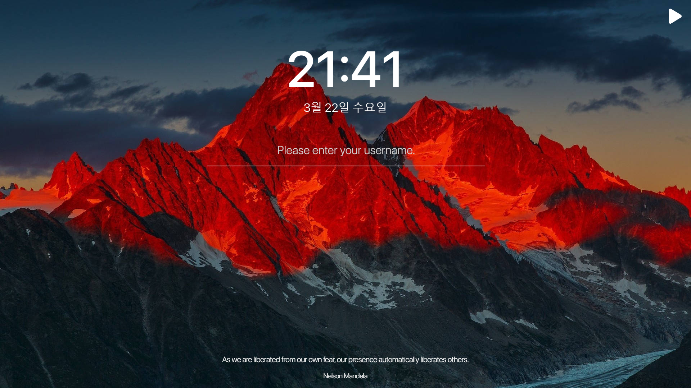

 

 
<h1> 
Dash
</h1>

Dash is a Personal Start Page with To-Do List.

 

<h1>
Homepage
</h1>

https://oh3823.github.io/dash

 

<h1>
Made with
</h1>

<h1> 
Features
</h1>

<li>
You can play a song by pressing the play button in the top-right corner.
</li>
<li>
Enter your username to enable To-Do List.
</li>
<li>
Your username and To-Dos will be stored in browser's Local Storage.
</li>
<li>
Click ✅ to delete To-Do.
</li>
<li>
Application fetchs a random quote when browser reloads.
</li>
<li>
Double click a greeting to clear browser's Local Storage.
</li>

 
<h1>

## I made it with reference to momentum.
